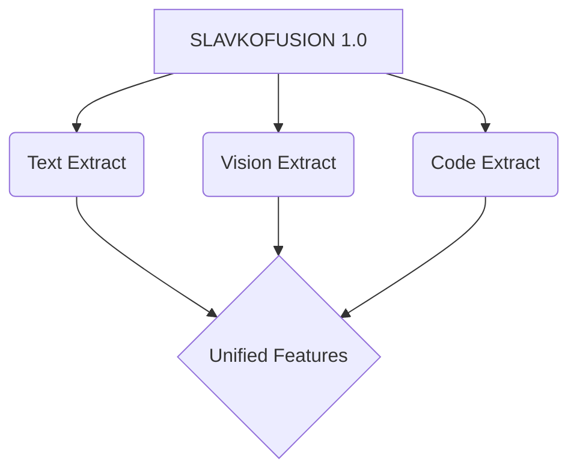

# 🔗 SlavkoFusion 1.0

<p align="center">
  
</p>

<p align="center">
  <strong>Multimodal Integration Layer</strong><br/>
  <em>Unified Feature Extraction for Text, Image, PDF & Code</em>
</p>

<p align="center">
  <a href="https://github.com/theOrchestrationAI/slavko-fusion/releases"></a>
  <a href="https://ollama.com/mladen-gertner/slavkofusion-v1"></a>
  <a href="LICENSE"></a>
</p>

<p align="center">
  
  
</p>

---

## 🎯 Overview

**SlavkoFusion 1.0** is the multimodal integration layer of the S.L.A.V.K.O.™ orchestration system. It unifies feature extraction across text, images, documents, and code into a consistent output schema for downstream processing.

---

## 🚀 Quick Start

```bash
# Run with Ollama (Vision Model)
ollama run mladen-gertner/slavkofusion-v1

# Process Image
curl -X POST http://localhost:11434/api/generate \
  -d '{
    "model": "mladen-gertner/slavkofusion-v1",
    "prompt": "Extract features from this document",
    "images": ["base64_encoded_image"]
  }'
```

---

## 🎨 Supported Modalities

| Modality      | Formats               | Capabilities          |
| :------------ | :-------------------- | :-------------------- |
| **Text**      | plain, markdown, html | Semantic extraction   |
| **Image**     | png, jpeg, webp       | OCR, object detection |
| **Document**  | pdf, docx             | Layout analysis       |
| **Code**      | all languages         | AST parsing           |
| **UI Mockup** | Figma, Sketch         | Component detection   |

---

## 🔬 Features Extracted

```json
{
  "modality": "text|image|document|code|mixed",
  "extraction": {
    "raw_text": "...",
    "structured_content": {},
    "entities": []
  },
  "features": {
    "semantic_embedding": [],
    "keywords": [],
    "topics": [],
    "complexity_score": 0.0-1.0
  },
  "vision": {
    "objects_detected": [],
    "text_extracted": "",
    "layout_analysis": {}
  },
  "code": {
    "language": "...",
    "ast_summary": {},
    "dependencies": []
  }
}
```

---

## 🏗️ Architecture



---

## 📞 Contact

**Mladen Gertner** — FormatDisc™, Zagreb, Croatia  
📧 mladen@formatdisc.hr | 🌐 [formatdisc.hr](https://formatdisc.hr)

---

<p align="center">
  <sub>© 2026 FormatDisc™, vl. Mladen Gertner — All Rights Reserved</sub>
</p>
